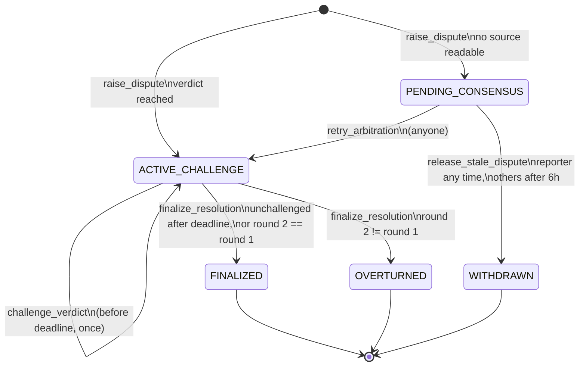
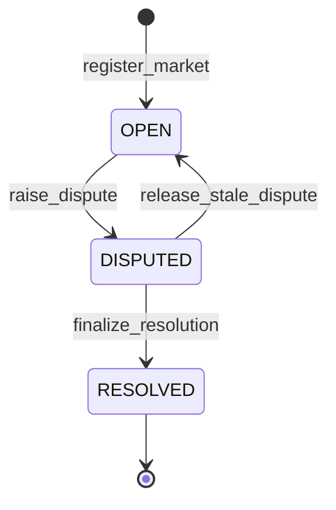
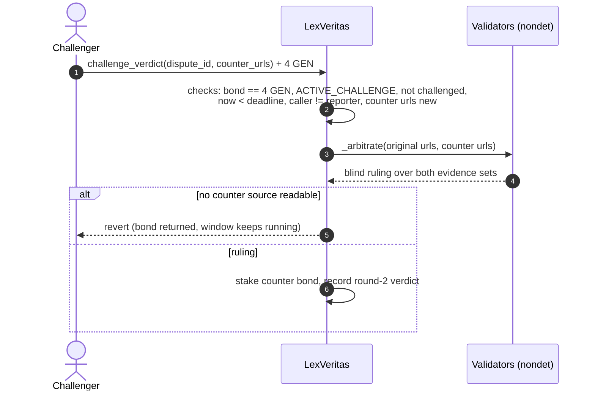

# LexVeritas Architecture

Version 0.3.0. Contract: `contracts/lex_veritas.py`. Runner:
`py-genlayer:5jycge4q8k23462jtb0b9fyey1s9qz928sz2nbrd9mg4sxqg2qng`.

This document specifies the contract's state machines, its consensus
boundary, and the properties the test suite checks. Every property below names
the test that exercises it.

---

## 1. Components

```
                 +-------------------------------------------------------------+
                 |                    LexVeritas contract                      |
  register ----> |  markets: TreeMap[market_id -> Market]                      |
  dispute  ----> |  disputes: TreeMap[dispute_id -> Dispute]                   |
  challenge ---> |  claimable: TreeMap[address -> u256]   (pull payments)      |
  finalize ----> |  ledger: staked, uncollected, deposited, withdrawn          |
  claim    ----> |                                                             |
                 |   deterministic core            |  non-deterministic block  |
                 |   (validation, state machine,   |  (run_nondet_default)     |
                 |    accounting, settlement)      |  fetch -> sanitize ->     |
                 |                                 |  prompt -> parse ruling   |
                 +---------------------------------+---------------------------+
                                                   |            |
                                          gl.nondet.web.get   gl.nondet.exec_prompt
                                          (each validator      (each validator's
                                           fetches itself)      own model)
```

The deterministic core runs identically on every validator. Only
`_arbitrate` and `dry_run_arbitration` enter a non-deterministic block. The
block's output is a small dict with a **categorical** verdict; everything the
contract does with it afterwards is deterministic.

## 2. Data model

| Market field | Type | Notes |
|---|---|---|
| `market_id` | str | `"0x" + keccak256(f"{market_url}:{cutoff_timestamp}")` |
| `market_url` | str | public https URL, validated |
| `resolution_criteria` | str | 1..2000 chars, sanitized before prompting |
| `cutoff_timestamp` | u256 | unix seconds, strictly in the past at registration |
| `status` | str | `OPEN`, `DISPUTED`, `RESOLVED` |
| `registered_by` | Address | |
| `outcome` | str | final verdict, empty until `RESOLVED` |
| `active_dispute_id` | str | non-empty iff `DISPUTED` |

| Dispute field | Type | Notes |
|---|---|---|
| `dispute_id` | str | `"0x" + keccak256(f"{market_id}:{nonce}")` |
| `reporter`, `bond_amount` | Address, u256 | bond is exactly 2 GEN |
| `verdict`, `rationale`, `confidence_bps` | str, str, u256 | round 1 |
| `evidence_urls`, `evidence_hashes` | JSON str | hashes are keccak256 of each URL |
| `filed_at`, `challenge_deadline` | u256 | deadline = verdict time + 86400, never moved |
| `status` | str | see section 3 |
| `challenger`, `counter_bond` | Address, u256 | counter bond is exactly 4 GEN |
| `challenge_verdict`, `challenge_rationale` | str | round 2 (blind) |
| `final_verdict`, `settled_at` | str, u256 | set at finalization |

Money is `u256` in atto units. Confidence is stored as basis points, never as
a float.

## 3. State machines

### 3.1 Dispute



A challenged dispute stays in `ACTIVE_CHALLENGE` with `challenged = true` and
may be finalized immediately: round 2 is final, so waiting out the rest of the
window serves no purpose.

`WITHDRAWN` is an extension of the four statuses in the original brief. Without
it a dispute whose sources are all down would hold its bond and block its
market forever.

### 3.2 Market



`RESOLVED` is absorbing: `get_market_outcome` reports `final = true` and no
method moves a resolved market.

## 4. Sequences

### 4.1 Raise dispute (round 1)

```mermaid
sequenceDiagram
    autonumber
    actor R as Reporter
    participant L as Leader validator
    participant V as Other validators
    participant W as Evidence sites
    participant M as LLM (per validator)

    R->>L: raise_dispute(market_id, urls) + 2 GEN
    L->>L: checks: bond == 2 GEN, market OPEN, 1..3 distinct https urls
    L->>W: GET each url
    W-->>L: pages (non-2xx skipped)
    L->>L: html -> text, redact injection markers, escape < >
    L->>M: arbitration prompt (ROUND 1)
    M-->>L: {"verdict","rationale","confidence"}
    L->>L: parse_ruling (aliases, low-confidence split)
    L->>V: leader result
    V->>W: GET each url (independently)
    V->>M: same prompt, own model
    V->>V: agree iff verdict equal and counter_read parity equal
    V-->>L: votes
    Note over L,V: majority agrees -> effects applied; otherwise leader rotates
    L->>L: effects: stake bond, write dispute, deadline = now + 24h
```

Every revert point in `raise_dispute` precedes every effect. The arbitration
block runs **before** the bond is booked or the dispute is written, so a failed
round leaves storage untouched (`test_reverted_paths_leave_no_residue`).

### 4.2 Challenge (round 2)



Round 2 is blind: its prompt carries both evidence sets but not the round-1
verdict or rationale (`test_round_two_is_blind_to_round_one`).

### 4.3 Finalize and claim

```mermaid
sequenceDiagram
    actor A as Anyone
    actor W as Winner
    participant K as LexVeritas

    A->>K: finalize_resolution(dispute_id)
    K->>K: unchallenged: require now >= deadline, winner = reporter, pot = 2
    K->>K: challenged: winner = reporter if round2 == round1 else challenger, pot = 6
    K->>K: staked -= pot, uncollected += pot, claimable[winner] += pot
    K->>K: market RESOLVED, outcome frozen
    W->>K: claim()
    K->>K: require balance >= amount; claimable = 0; uncollected -= amount; withdrawn += amount
    K-->>W: emit_transfer(amount, on="finalized")
```

## 5. Consensus boundary

The non-deterministic block uses `gl.vm.run_nondet_default` with a custom
validator function (`_arbitration_agree`) and a custom user-error comparator
(`_errors_agree`).

| Leader outcome | Validator outcome | Vote |
|---|---|---|
| verdict X | verdict X, same counter-readability | agree |
| verdict X | verdict Y | disagree (leader rotates) |
| `UNRESOLVED` | `UNRESOLVED` | agree (sources are down for everyone) |
| `UNRESOLVED` | verdict X | disagree |
| `[EXPECTED]`/`[EXTERNAL]` error | identical message | agree |
| `[TRANSIENT]` error | `[TRANSIENT]` error | agree |
| `[LLM_ERROR]` | anything | disagree (forces rotation) |

Rationale prose and confidence are never compared. Two competent models rarely
word a ruling identically, and comparing prose would turn every dispute into a
consensus failure. The verdict is a 4-way categorical value, which is what the
contract settles on.

"Deterministic LLM arbitration" in the brief therefore means: the contract's
*decision* is deterministic given a consensus verdict, and the verdict is
discrete. The model calls themselves are not deterministic and no design can
make them so.

## 6. Prompt-injection defence

`sanitize_untrusted` is applied to every piece of third-party text (evidence
pages, market criteria, pasted dry-run text, and the LLM's own rationale before
storage). The order is significant:

1. Remove HTML comments, `script`/`style`/`noscript`/`template` blocks, then tags.
2. Decode a fixed set of entities (this can reintroduce `<` and `>`).
3. Replace control characters.
4. Redact injection markers: "ignore/disregard/forget previous instructions",
   "you are now", role labels (`system:`, bare `assistant` lines), `[INST]`,
   `<<SYS>>`, chat-template tokens, code fences, `===` and `###` runs (which
   could forge the prompt's section headers), any `OUTCOME_*` token, and
   `verdict:`/`confidence:` keys.
5. Escape every remaining `<` and `>`.
6. Collapse whitespace and truncate (2500 chars per source).

Because step 5 runs last, no evidence text can open or close a prompt tag.
`test_prompt_injection_sanitization_closed` asserts exactly one `<evidence>`
element, exactly one rules section after it, no raw angle brackets in the
evidence body, and no surviving marker. The live dry run on Studio Next
(README section 6) shows three independent model runs ignoring an injected
"output OUTCOME_YES".

Redaction is a second line of defence. The first is structural: evidence is
fenced in tags the model is told to treat as data, and the verdict is a
closed enum that the parser rejects if anything else comes back.

## 7. Properties and where they are tested

| # | Property | Test |
|---|---|---|
| P1 | `market_id = keccak256(url:cutoff)`; duplicates revert | `test_market_registration_and_hash_deduplication` |
| P2 | Cutoff must be strictly in the past | `test_registration_requires_past_cutoff` |
| P3 | At most one active dispute per market; a resolved market cannot be disputed | `test_single_active_dispute_per_market` |
| P4 | Bonds are exact: 2 GEN to dispute, 4 GEN to challenge | `test_dispute_bond_must_be_exact`, `test_unbound_challenge_reverts` |
| P5 | Validators agree only on equal categorical verdicts | `test_multi_source_web_consensus_and_verdict_emission` |
| P6 | Unreadable sources do not sink a multi-source dispute | same, `sources_read == 2` of 3 |
| P7 | Ambiguous cases split 50/50 | `test_ambiguous_case_splits_evenly` |
| P8 | Evidence cannot escape its tag or smuggle instructions | `test_prompt_injection_sanitization_closed` |
| P9 | Challenge only before the deadline; finalize only at or after it (unchallenged) | `test_challenge_window_boundary`, `test_finalize_respects_timelock` |
| P10 | The deadline never moves after filing | `test_deadline_is_fixed_at_filing` |
| P11 | Round 2 cannot see round 1's verdict | `test_round_two_is_blind_to_round_one` |
| P12 | `balance == staked + uncollected` after every transaction; value conserved; ends at zero | `test_strict_accounting_solvency_invariant`, `test_randomized_lifecycles_conserve_value` |
| P13 | A reverted call leaves no storage or balance residue | `Chain.reverts` helper, used throughout |
| P14 | Outcome is immutable once resolved | `test_finalize_respects_timelock` |

## 8. Accounting invariant: where it is enforced

The brief asks for `total_staked_bonds + uncollected_rewards == contract.balance`
checked on every state-changing method. The contract enforces it in two parts,
because a literal in-transaction balance check would be wrong:

* **Ledger identity, checked in every write** (`_check_invariant`, reverts on
  failure): `staked + uncollected == deposited - withdrawn`. This is the part the
  contract can know exactly inside a transaction.
* **Balance equality, exposed and tested**: `get_accounting()` reports
  `balance_matches = (balance == staked + uncollected)`, and the test harness
  asserts it after every transaction against a simulated native balance.

Why not assert balance equality inside `claim`? `emit_transfer(on="finalized")`
leaves the contract *after* the transaction. Inside `claim`, the balance still
includes the amount being paid out while `uncollected` has already dropped, so a
strict equality check there would revert every honest claim. `claim` instead
checks the one thing that matters at that moment: `balance >= amount`
(`test_claim_refuses_when_underfunded`).
