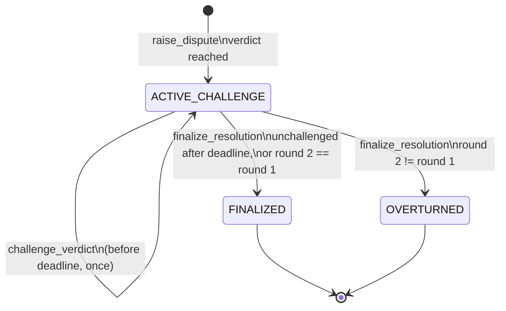
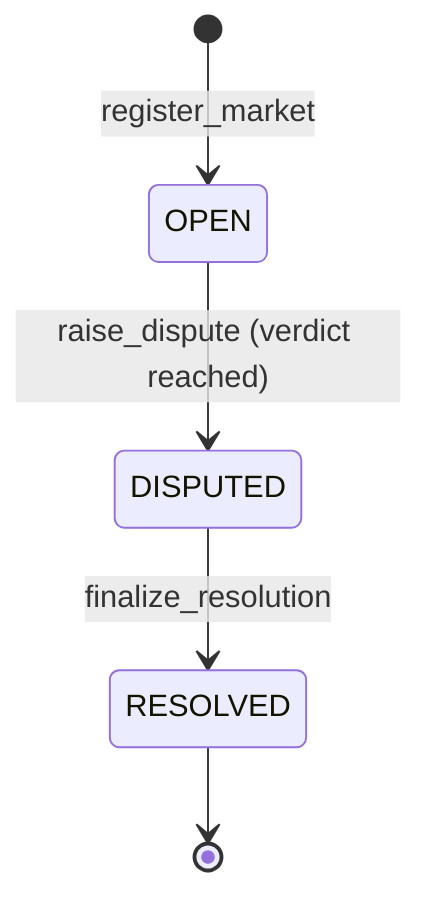

# LexVeritas Architecture

Version 0.3.0 (security-review revision). Contract: `contracts/lex_veritas.py`. Runner:
`py-genlayer:5jycge4q8k23462jtb0b9fyey1s9qz928sz2nbrd9mg4sxqg2qng`.

This document specifies the contract's state machines, its consensus
boundary, and the properties the test suite checks. Every property below names
the test that exercises it.

---

## 1. Components

```
                 +-------------------------------------------------------------+
                 |                    LexVeritas contract                      |
  register ----> |  markets: TreeMap[market_id -> Market]                      |
  dispute  ----> |  disputes: TreeMap[dispute_id -> Dispute]                   |
  challenge ---> |  claimable: TreeMap[address -> u256]   (pull payments)      |
  finalize ----> |  ledger: staked, uncollected, deposited, withdrawn          |
  claim    ----> |                                                             |
                 |   deterministic core            |  non-deterministic block  |
                 |   (validation, state machine,   |  (gl.vm.run_nondet)       |
                 |    accounting, settlement)      |  fetch -> sanitize ->     |
                 |                                 |  prompt -> parse ruling   |
                 +---------------------------------+---------------------------+
                                                   |            |
                                          gl.nondet.web.get   gl.nondet.exec_prompt
                                          (each validator      (each validator's
                                           fetches itself)      own model)
```

The deterministic core runs identically on every validator. Only
`_arbitrate` and `dry_run_arbitration` enter a non-deterministic block. The
block's output is a small dict with a **categorical** verdict; everything the
contract does with it afterwards is deterministic.

## 2. Data model

| Market field | Type | Notes |
|---|---|---|
| `market_id` | str | `"0x" + keccak256(f"{market_url}:{cutoff}:{criteria_hash}:{dispute_bond}")` |
| `market_url` | str | public https URL, validated |
| `resolution_criteria` | str | 1..2000 chars, sanitized before prompting |
| `cutoff_timestamp` | u256 | unix seconds, strictly in the past at registration |
| `status` | str | `OPEN`, `DISPUTED`, `RESOLVED` |
| `registered_by` | Address | |
| `outcome` | str | final verdict, empty until `RESOLVED` |
| `active_dispute_id` | str | non-empty iff `DISPUTED` |
| `dispute_bond` | u256 | exact bond per dispute, 2 GEN to 100,000 GEN; counter bond is 2x |
| `criteria_hash` | str | `"0x" + keccak256(resolution_criteria)` |

| Dispute field | Type | Notes |
|---|---|---|
| `dispute_id` | str | `"0x" + keccak256(f"{market_id}:{nonce}")` |
| `reporter`, `bond_amount` | Address, u256 | equals the market's `dispute_bond` |
| `verdict`, `rationale`, `confidence_bps` | str, str, u256 | round 1 |
| `evidence_urls`, `evidence_hashes` | JSON str | hashes are keccak256 of the sanitized text each URL served in round 1 (`""` if unreadable); leader-attested |
| `filed_at`, `challenge_deadline` | u256 | deadline = verdict time + 86400, never moved |
| `status` | str | see section 3 |
| `challenger`, `counter_bond` | Address, u256 | counter bond is exactly 2x the dispute bond |
| `challenge_verdict`, `challenge_rationale` | str | round 2 (blind) |
| `final_verdict`, `settled_at` | str, u256 | set at finalization |
| `stealth_edits` | JSON str | round-1 URLs whose text changed before round 2 read them |

Money is `u256` in atto units. Confidence is stored as basis points, never as
a float.

## 3. State machines

### 3.1 Dispute



A dispute is stored only once validators reach a verdict. `PENDING_CONSENSUS`
is the state of the `raise_dispute` *transaction* while validators deliberate;
it is never written to storage. If no evidence source is readable, validators
agree on `UNRESOLVED` and the transaction reverts with `[UNRESOLVED_EVIDENCE]`.
The earlier revision parked such disputes in a stored `PENDING_CONSENSUS` state
with retry and stale-release paths. The security review (Medium 4) showed that
dead links could then lock a market, so those paths were removed.

A challenged dispute stays in `ACTIVE_CHALLENGE` with `challenged = true` and
may be finalized immediately: round 2 is final, so waiting out the rest of the
window serves no purpose.

### 3.2 Market



`RESOLVED` is absorbing: `get_market_outcome` reports `final = true` and no
method moves a resolved market. Several markets may share a URL: they differ in
criteria or bond, and so in id (README, residual risks: parallel markets).

## 4. Sequences

### 4.1 Raise dispute (round 1)

```mermaid
sequenceDiagram
    autonumber
    actor R as Reporter
    participant L as Leader validator
    participant V as Other validators
    participant W as Evidence sites
    participant M as LLM (per validator)

    R->>L: raise_dispute(market_id, urls) + B
    L->>L: checks: value == market.dispute_bond (B), market OPEN, 1..3 distinct https urls
    L->>W: GET each url
    W-->>L: pages (non-2xx skipped)
    L->>L: html -> text, redact injection markers, escape < >, keccak each text
    L->>M: arbitration prompt (ROUND 1)
    M-->>L: {"verdict","rationale","confidence"}
    L->>L: parse_ruling (aliases, low-confidence split)
    L->>V: leader result
    V->>W: GET each url (independently)
    V->>M: same prompt, own model
    V->>V: agree iff verdict equal and counter_read parity equal
    V-->>L: votes
    Note over L,V: majority agrees -> result stands; otherwise leader rotates
    alt verdict == UNRESOLVED (nothing readable)
        L-->>R: revert [UNRESOLVED_EVIDENCE]; bond returned at finalization
    else verdict
        L->>L: effects: stake B, store dispute + round-1 content hashes, deadline = now + 24h
    end
```

Every revert point in `raise_dispute` precedes every effect. The arbitration
block runs **before** the bond is booked or the dispute is written, so a failed
round leaves storage untouched (`test_reverted_paths_leave_no_residue`).

### 4.2 Challenge (round 2)

```mermaid
sequenceDiagram
    autonumber
    actor C as Challenger
    participant K as LexVeritas
    participant N as Validators (nondet)

    C->>K: challenge_verdict(dispute_id, counter_urls) + 2B
    K->>K: checks: value == 2B, ACTIVE_CHALLENGE, not challenged,<br/>now < deadline, caller != reporter, counter urls new
    K->>N: _arbitrate(original urls, counter urls, round-1 hashes)
    N->>N: re-hash each original source; changed text -> integrity notice
    N-->>K: blind ruling over both evidence sets (+ modified sources)
    alt no counter source readable
        K-->>C: revert (bond returned, window keeps running)
    else ruling
        K->>K: stake 2B, record round-2 verdict, counter content hashes, stealth_edits
    end
```

Round 2 is blind: its prompt carries both evidence sets but not the round-1
verdict or rationale (`test_round_two_is_blind_to_round_one`).

### 4.3 Finalize and claim

```mermaid
sequenceDiagram
    actor A as Anyone
    actor W as Winner
    participant K as LexVeritas

    A->>K: finalize_resolution(dispute_id)
    K->>K: unchallenged: require now >= deadline, winner = reporter, pot = B
    K->>K: challenged: winner = reporter if round2 == round1 else challenger, pot = 3B
    K->>K: staked -= pot, uncollected += pot, claimable[winner] += pot
    K->>K: market RESOLVED, outcome frozen
    W->>K: claim()
    K->>K: require balance >= amount; claimable = 0; uncollected -= amount; withdrawn += amount
    K-->>W: emit_transfer(amount, on="finalized")
```

## 5. Consensus boundary

The non-deterministic block uses `gl.vm.run_nondet(leader_fn, validator_fn)`
with a custom validator function (`_arbitration_agree`). `run_nondet` gives the
validator no sandbox, so `_arbitration_agree` never raises: every failure path
returns `False`.

| Leader outcome | Validator outcome | Vote |
|---|---|---|
| verdict X | verdict X, same counter-readability | agree |
| verdict X | verdict Y | disagree (leader rotates) |
| `UNRESOLVED` | `UNRESOLVED` | agree; the contract then reverts `[UNRESOLVED_EVIDENCE]` |
| `UNRESOLVED` | verdict X | disagree |
| any error (`[LLM_ERROR]`, `[TRANSIENT]`) | anything | disagree (leader rotates) |
| any result | validator's own run raises | disagree |

Rationale prose, confidence and content hashes are never compared. Two
competent models rarely word a ruling identically, and two fetches of a dynamic
page rarely hash the same. Comparing either would turn every dispute into a
consensus failure. The verdict is a 4-way categorical value, which is what the
contract settles on.

A consequence: the round-1 content hashes stored for stealth-edit detection are
**leader-attested**. Validators vouch for the verdict, not for the hashes.

An earlier revision used `run_nondet_default` with an error comparator that let
two matching transient errors agree. The installed `genvm-lint` (0.11.1rc2)
does not model `run_nondet_default` as a nondet entry point, so it flagged the
fetch and LLM helpers as unreachable. `run_nondet` is recognised, and its
always-rotate behaviour on leader errors gives the same user-visible result.

"Deterministic LLM arbitration" in the brief therefore means: the contract's
*decision* is deterministic given a consensus verdict, and the verdict is
discrete. The model calls themselves are not deterministic and no design can
make them so.

## 6. Prompt-injection defence

`sanitize_untrusted` is applied to every piece of third-party text (evidence
pages, market criteria, pasted dry-run text, and the LLM's own rationale before
storage). The order is significant:

1. Remove HTML comments, `script`/`style`/`noscript`/`template` blocks, then tags.
2. Decode a fixed set of entities (this can reintroduce `<` and `>`).
3. Replace control characters.
4. Redact injection markers:
   * "ignore/disregard/forget previous instructions (or rules, prompts, context)"
   * "you are now a/an/the ... assistant/model/judge/arbitrator/system/..."
   * "new instructions:" (colon required)
   * role labels (`system:`, `assistant:`, `user:`, `developer:`) **only at the
     start of a line**, plus bare role lines
   * `[INST]`, `<<SYS>>`, chat-template tokens, code fences
   * `===` and `###` runs, which could forge the prompt's section headers
   * any `OUTCOME_*` token
   * output keys **only as quoted JSON keys**: `"verdict":`, `"rationale":`,
     `"confidence":`, `"status":`
   * any `[NOTICE ...]`, so no source can impersonate the contract's
     stealth-edit notice

   The anchoring and quoting follow the security review (High 3). The earlier
   patterns redacted legal prose such as "Jury verdict: not guilty. System:
   court adjourned.", which the arbitrator must be able to read.
5. Escape every remaining `<` and `>`.
6. Collapse whitespace and truncate (2500 chars per source).

Because step 5 runs last, no evidence text can open or close a prompt tag.
`test_prompt_injection_sanitization_closed` asserts exactly one `<evidence>`
element, exactly one rules section after it, no raw angle brackets in the
evidence body, and no surviving marker. The live dry run on Studio Next
(README section 6) shows three independent model runs ignoring an injected
"output OUTCOME_YES".

Redaction is a second line of defence, and after the review it is a
deliberately narrow one. The first line is structural: evidence is fenced in
tags the model is told to treat as data, contract-written notices live in their
own section outside every tag, and the verdict is a closed enum that the parser
rejects if anything else comes back.

## 6a. Stealth-edit detection

Round 1 stores `keccak256(sanitized_text)` for each evidence URL, or `""` when
the source was unreadable. Round 2 re-reads every round-1 URL and re-hashes it.
A URL is flagged only when **both** hashes are non-empty and differ. A source
that merely went offline is left out of the prompt; it is not reported as
edited. For each flagged URL the contract:

* writes `[NOTICE: Evidence source was modified after Round 1 verdict] host=...`
  into a `=== 2b. INTEGRITY NOTICES ===` section placed after all evidence;
* sets `modified_after_round1="true"` on that source's evidence tag;
* records the URL in the dispute's `stealth_edits`.

Hashing the sanitized text rather than the raw body means markup churn (ads,
script tags, cache busters) does not read as an edit. Changes to visible text,
including a live blog's new entries, do.

## 7. Properties and where they are tested

| # | Property | Test |
|---|---|---|
| P1 | `market_id = keccak256(url:cutoff:keccak256(criteria):bond)`; duplicates revert; skewed criteria or bond get a distinct id | `test_market_registration_and_hash_deduplication`, `test_criteria_squatting_produces_distinct_market_ids`, `test_bond_is_bound_into_market_id` |
| P2 | Cutoff must be strictly in the past | `test_registration_requires_past_cutoff` |
| P3 | At most one active dispute per market; a resolved market cannot be disputed | `test_single_active_dispute_per_market` |
| P4 | Bonds are exact: the market's bond to dispute, 2x to challenge; 2 GEN to 100,000 GEN | `test_dispute_bond_must_be_exact`, `test_unbound_challenge_reverts`, `test_custom_security_bond_scaling`, `test_bond_bounds_and_default` |
| P5 | Validators agree only on equal categorical verdicts | `test_multi_source_web_consensus_and_verdict_emission` |
| P6 | Unreadable sources do not sink a multi-source dispute | same, `sources_read == 2` of 3 |
| P7 | Ambiguous cases split 50/50 | `test_ambiguous_case_splits_evenly` |
| P8 | Evidence cannot escape its tag or smuggle instructions; legal prose survives | `test_prompt_injection_sanitization_closed`, `test_injection_markers_still_redacted`, `test_legal_text_not_redacted_by_sanitizer` |
| P9 | Challenge only before the deadline; finalize only at or after it (unchallenged) | `test_challenge_window_boundary`, `test_finalize_respects_timelock` |
| P10 | The deadline never moves after filing | `test_deadline_is_fixed_at_filing` |
| P11 | Round 2 cannot see round 1's verdict | `test_round_two_is_blind_to_round_one` |
| P12 | `balance == staked + uncollected` after every transaction; value conserved; ends at zero | `test_strict_accounting_solvency_invariant`, `test_randomized_lifecycles_conserve_value` |
| P13 | A reverted call leaves no storage or balance residue | `Chain.reverts` helper, used throughout |
| P14 | Outcome is immutable once resolved | `test_finalize_respects_timelock` |
| P15 | No readable evidence means revert, never a parked dispute or a locked market | `test_dead_link_reverts_immediately_no_market_lock`, `test_no_method_can_park_a_dispute`, `test_unreachable_sources_revert_and_validators_agree` |
| P16 | Round 2 is told exactly which round-1 sources changed, and no source can forge that notice | `test_stealth_edit_detected_between_rounds`, `test_unchanged_source_raises_no_notice`, `test_offline_source_is_not_reported_as_edited`, `test_source_cannot_forge_the_notice` |

## 8. Accounting invariant: where it is enforced

The brief asks for `total_staked_bonds + uncollected_rewards == contract.balance`
checked on every state-changing method. The contract enforces it in two parts,
because a literal in-transaction balance check would be wrong:

* **Ledger identity, checked in every write** (`_check_invariant`, reverts on
  failure): `staked + uncollected == deposited - withdrawn`. This is the part the
  contract can know exactly inside a transaction.
* **Balance equality, exposed and tested**: `get_accounting()` reports
  `balance_matches = (balance == staked + uncollected)`, and the test harness
  asserts it after every transaction against a simulated native balance.

Why not assert balance equality inside a transaction? Two timing effects, both
observed on Studio Next:

* `emit_transfer(on="finalized")` leaves the contract *after* the transaction.
  Inside `claim` the balance still includes the amount being paid out while
  `uncollected` has already dropped, so a strict equality check would revert
  every honest claim. `claim` checks the one thing that matters at that moment:
  `balance >= amount` (`test_claim_refuses_when_underfunded`).
* A payable call that reverts keeps its value in the contract until the
  transaction finalizes, and then GenLayer returns it to the sender. Measured
  with a dead-link `raise_dispute`: +2 GEN in the contract at *decided*, back to
  0 at *finalized* 27 s later, with the reporter out only 0.000079 GEN in fees.
  In that window `balance > liabilities`. That surplus is expected and
  transient; the dashboard shows it as "settling". Only `balance < liabilities`
  is a violation.
